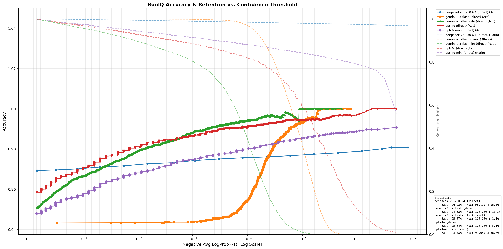

# Methodology & Framework

This paper proposes a standardized evaluation framework designed to address the challenges of inconsistent criteria, high subjectivity, and poor reproducibility in assessing Large Language Models (LLMs) for long-context memory and retrieval tasks.

The proposed framework deviates from conventional evaluation methods based on Likert scales (1-5 scoring) by adopting **Binary Logical Verification** as its core assessment paradigm. This is supplemented by **Probabilistic Confidence** analysis, thereby establishing an objective, rigorous, and quantifiable benchmark system.
## Binary LLM as a Judge 

In complex long-text question answering and Agent memory evaluation, the boundary between "good" and "bad" is often ambiguous, yet the logical implication relationship between "true" and "false" remains deterministic.We formalize the evaluation task as a binary classification problem defined by a triplet $(C, Q, A)$, where $C$ represents the Context/Ground Truth (context memory), $Q$ is the Query (question), and $A$ is the Answer to be evaluated.The Judge LLM is required to determine whether $A$ is strictly and logically implied by the factual description in $C$ corresponding to $Q$:

$$
f_{judge}(C, Q, A) \in \{\text{True}, \text{False}\}
$$

This Binary LLM as a Judge approach compels the model to abandon ambiguous intermediate scores (such as "3 points" or "4 points"), thereby eliminating the Central Tendency Bias and significantly enhancing the Consistency and Objectivity of the evaluation results. Any factual error or hallucination will be judged as False under this strict binary perspective, thus ensuring a high standard of assessment.

## Logprobs-based Confidence Metric

To address the limitations in granularity of binary classification, and to investigate the certainty of model judgements during the validation of foundational capabilities in Phase One, a confidence metric was introduced that was based on model output log-probabilities in the **BoolQ validation experiment** (the purpose of this metric is primarily to validate the reliability boundaries of the Judge LLM itself, and it was not directly applied to the scoring system of the MemIndex Benchmark).

For each decision rendered by the adjudicative model, two things are recorded: its textual output and the average log probability of generated tokens.

$$
\bar{p} = \frac{1}{N} \sum_{i=1}^{N} \log P(t_i | t_{<i}, \text{context})
$$

Then calculate the confidence score $Confidence = e^{\bar{p}}$.This metric introduces a continuous confidence dimension to the binary result, enabling us to distinguish between "confidently correct" and "tentatively correct" judgments.By setting a confidence threshold $t$, we can filter out low-confidence judgments, thereby finding the optimal balance point between Accuracy and Coverage, thus achieving a Meta-Evaluation of the Judge model's inherent reliability.

## Strict Output Enforcement Protocols 

In order to guarantee the machine readability and stability of the model's outputs, the framework delineates three standardised interaction protocols, with the objective of accommodating varying model capabilities and application scenarios.

1.  **Direct Mode**: The model is compelled to produce solely the words `true` or  `false`. This mode has been engineered to maximally suppress autoregressive interference from Chain of Thought (CoT) reasoning, rendering it suitable for large-scale validation scenarios requiring extremely high throughput and low latency.
2.  **SSE Mode**: The data is arranged in a row-based  `key: value` format, for example, `reason: ... \n answer: ...`. This approach maintains the interpretability of the reasoning process while supporting streaming parsing, facilitating real-time monitoring and evaluation of the logic.
3.  **JSON Mode**: The implementation of complete JSON object output is enforced, rendering it suitable for scenarios necessitating programmatic parsing of complex reasoning logic or integration with other automated systems.

The aforementioned three modes collectively constitute the framework's interface layer. By means of a strict constraint on the output space through prompt engineering, the transformation of natural language-generated evaluation tasks into quasi-deterministic classification tasks is achieved.

# Experiments
## BoolQ Binary Classification Experiment
Based on the BoolQ dataset [ref] provided by Google, this experiment is designed to assess the performance of LLMs in binary classification tasks.

### Experimental Setup

---

The Google BoolQ dataset [ref] was utilised, containing a total of 15,942 instances. Each instance comprises three core features: a textual question, a binary answer, and a contextual passage (serving as evidence to support the answer).

The present dataset is employed for the purpose of evaluating the binary classification capabilities of Large Language Models (LLMs). The methodology employed is composed of three distinct response-style prompts, each of which is paired with a specific data parsing and post-processing pipeline.

#### LLM Judge Prompt

The system prompt designed for the LLM is as follows:

```text
"You are an assistant specialized in logical verification based on provided text. You must perform logical reasoning strictly according to the content in the Passage to analyze the binary inquiry in the Question and determine whether it aligns with the provided Answer."
```

##### Direct Mode: Binary Response Pattern
In this mode, the Large Language Model (LLM) is required to respond exclusively with either 'true' or 'false', with no additional output permitted. The restriction of the model to a simple binary token output effectively transforms the LLM into a prompt-based binary text classifier.

This approach is specifically designed to maximise the suppression of statistical cumulative instability inherent in the auto-regressive architecture of LLMs.

[这里插入一段简单的，累乘高概率最后变成低概率的数学公式]
```text
# Instructions
Please perform your reasoning strictly according to these steps:
1. Analyze the logic within the "Passage," which serves as the sole basis for reasoning the answer to the "Question."
2. Derive an answer to the "Question" exclusively based on the "Passage."
3. Compare your result with the "Human Judgment Answer" to determine its correctness.

Strict Constraint: Output ONLY 'true' (if the answer is correct) or 'false' (if the answer is incorrect). Do not provide any additional information or explanation.
```
##### SSE Mode: HTTP SSE-Inspired Output Pattern
This mode allows the LLM to output answers in a simplified format without the strict syntactical overhead of JSON, thereby preventing the unnecessary allocation of computational resources to structural formatting. The required output format is defined as:
$$
answer: boolean\\
reason: string
$$
This format is inherently human-centric, offering high readability. By enabling the reason field within this mode, we facilitate a deeper interpretability analysis of the LLM's underlying decision-making logic.

We normalize the LLM’s output using the following prompt:
```text
# Output Format
Please strictly follow the format below and do not include any extraneous content:

reason: 1. Cause: ..., Outcome: ...; 2. Cause: ..., Outcome: ...
answer: [True / False]
```

##### JSON Mode: Generalised Structured Output Pattern
This mode is considered to represent the industry standard for the transformation of Large Language Models into functional "Work Models" [ref]. In JSON mode, the LLM is required to encapsulate both the reason and the answer within a structured JSON format to facilitate seamless programmatic parsing.

With regard to universal compatibility, the methodology employed involves the configuration of the API parameter to `response_format = json_object`in conjunction with the implementation of robust regular expression (Regex) adaptation. This is a consequence of the inconsistent output behaviours exhibited by different models. While some models generate raw JSON strings, others wrap the content in Markdown code blocks (e.g., ` ```json\n{json string}\n``` `). The experimental pipeline has been designed to dynamically adapt to these variations in order to ensure data integrity.

The following prompt is employed to standardise the LLM's output:
```text
# Output Format (JSON)
You must output a valid JSON object:
```json
{
"reason": "1. Cause: ..., Outcome: ...; 2. Cause: ..., Outcome: ...; ......",
"answer": <boolean>
}
```\n
answer true: Indicates that the Human Judgment label is logically sound and correctly reflects the relationship between the passage and the question.

answer false: Indicates a contradiction or an error within the Human Judgment annotation, suggesting the label is inconsistent with the provided evidence.
```
### Data Pre-processing and Quality Control
---
Following a manual inspection, it was determined that the original dataset could not be utilised directly due to the presence of contentious samples. These problematic entries are typically categorised into two main types: non-binary responses, where the question cannot be answered with a simple true/false, and irrelevant context, where the question is decoupled from the provided passage.

In order to guarantee the validity of the evaluation, a hybrid cleaning pipeline was implemented. The process entails the implementation of a preliminary filtration procedure, which is based on the LLM. This is followed by a meticulous, item-by-item audit of the candidates that have been filtered. The aforementioned controversial instances were then consolidated into a single file, designated as dirty_data.jsonl. During the subsequent testing phase, this "exclusion list" was loaded to ensure that the benchmarks were conducted exclusively on the refined "clean" dataset.
[这里插入争议数据集分类类别数据表]

### Experimental parameters
---

In the present experiments, a range of metrics were incorporated with a view to providing a comprehensive evaluation. The primary metric utilised to evaluate the accuracy of the results is based on the "true" or "false" tokens returned by the Large Language Model. Concurrently, the log-probabilities (logprobs) were requested from the API server to serve as a quantitative measure of model confidence.The experimental results are structured and stored as an array of tuples, defined as follows:
$$
\mathcal{D} = \{ (a_i, p_i, r_i) \}_{i=1}^N
$$
Specifically，$\mathcal{D}$ denote the experimental result set，where 
**$N$ represents the total number of questions within the BoolQ Dataset ** 

For each instance $i$ ，$a_i$ is the boolean answer，$p_i$ is the maximum log-probability associated with that answer, and $r_i$ is the generated explanation.
Notably, the $r_i$ component is optional in SSE and JSON modes, whereas it is non-existent (null) in Direct mode.

To evaluate a specific LLM, we perform an instance-by-instance assessment across the entire cleaned dataset, calculating the accuracy by verifying the alignment between the model's responses and the ground truth. Furthermore, we employ $p_i$ for threshold-based filtering. Given a threshold $t$, we exclude entries where $p_i \leq t$. We then calculate both the filtered accuracy and the data retention rate (the percentage of filtered instances relative to the total dataset size).

The filtering logic is formulated as follows:
$$
\mathcal{D}_t = \{(a_i,p_i) ∈ \mathcal{D} | p_i ≤ t\}
$$

The evaluation metrics are defined as follows:
Accuracy after filtering at threshold $t$:
$$
Acc(t) = \frac{\sum_{(a_i, p_i, r_i) \in \mathcal{D}_t} a_i}{|\mathcal{D}_t|}
$$

Data retention rate at threshold $t$:
$$
Rate(t) = \frac{|\mathcal{D}_t|}{N}
$$

### Implementation Details
---

The following section details the implementation process.
For the purposes of this study, Python was employed as the primary programming language for the experiments, with an asynchronous programming model (asyncio) being utilised to achieve high-concurrency calls to the Large Language Model (LLM) APIs. The experimental framework is comprised of the following core components:

#### The process of loading and managing data sets

The Hugging Face datasets library was utilised to load the Google BoolQ dataset. The DatasetManager component provides support for three distinct data split modes: train, validation, and all. In order to implement robust filtration of "dirty data," a SHA-256 hash value is computed for each individual data entry.
$$
hash_i = SHA256(question_i || passage_i || answer_i)
$$
By referencing a pre-annotated hash list of "dirty data," the framework automatically bypasses unqualified data entries during the iteration process.

#### Concurrency Control and Request Management
To optimize API throughput while ensuring compliance with rate limits, we implemented a semaphore mechanism to regulate the maximum number of concurrent requests, which is set to a default of 10. Simultaneously, we developed an exponential backoff retry strategy to handle transient API errors, formulated as:
$$
delay_k = t_{base} \times 2^k
$$
where $t_{base}$ represents the base retry latency (defaulting to 5 seconds) and $k$ denotes the current retry attempt. The maximum number of retries is capped at 5. Our system is configured to handle various retryable error types, including rate limits (HTTP 429), server-side errors (500, 502, 503, 504), as well as timeouts and connection disruptions.

#### LLM Client Encapsulation
The LiteLLM interface was employed as a unifying element for LLM invocations, thereby enabling seamless transitions between various API providers, including OpenRouter and Google Vertex AI. In the context of the Gemini model series, the Google GenAI SDK has been integrated with a specific objective in mind: to capitalise on the inherent support for log-probabilities (logprobs) within the framework. In order to monitor performance, the client logs the initiation timestamp of each request and calculates the inference latency upon receiving the response:
$$
latency_i = t_{response} - t_{request}
$$

#### Response Parsers

Specifically, a range of response parsing strategies was implemented, with each tailored for one of the three distinct output formats.

- **DirectModeParsing**:The utilisation of regular expressions (Regex) is employed for the purpose of matching standalone word boundaries for the values `\btrue\b` or `\bfalse\b`
- **SSEModeParsing**:Regex is employed to extract fields that match the given pattern:`answer:\s*(true|false)`
- **JSONModeParsing**:The system under discussion has the capacity to support both raw JSON strings and JSON objects that are encapsulated within code blocks that are denoted by the characters "`json`". The system extracts the JSON object by locating the first occurrence of `{`and the final occurrence of `}`.

In order to mitigate the occurrence of occasional formatting irregularities, the system has been programmed to automatically perform up to two retries upon the occurrence of a parsing failure, thus ensuring a higher degree of data reliability.

#### LogProbs Collection and Confidence Quantification
In the context of our API requests, the logprobs parameter is enabled, and top_logprobs=5 is set to capture the top five candidate probabilities for each output token. For each response, the log-probabilities of all generated tokens are aggregated and their arithmetic mean is computed.
$$
\bar{p}_i = \frac{1}{|T_i|} \sum_{t \in T_i} \log P(t)
$$
In this context, $T_i$ is used to denote the token sequence of the $i$-th response. The final confidence score is then derived via an exponential transformation of the average log-probability:
$$
confidence_i = e^{\bar{p}_i}
$$

#### Cost Estimation
The completion_cost function from the LiteLLM library was utilised to perform real-time cost accounting. For models not natively supported by the library, an internal fallback pricing table has been implemented. The cost analysis encapsulates input token expenses, output token expenses, and the total expenditure, providing both real-time monitoring and projected total costs for the entire experimental run.

#### Data Persistence and Logging
The experimental results are streamed in real-time to JSONL (JSON Lines) files via an AsyncResultWriter, ensuring data integrity during high-concurrency execution. Each record is characterised by its high level of granularity, with the following fields incorporated:(这里ai自动分类了子项)
Contextual Data: Question, Passage, and Index.

Model Performance: The following three elements are to be considered: human judgment (ground truth), predicted answer and correctness.

Reasoning & Meta-data: The following elements are to be considered: raw response, parsed reasoning, inference latency and timestamp.

Probabilistic and Statistical Data: The following data is to be provided: a SHA-256 hash, average log-probabilities, confidence scores and the complete log-probabilities distribution list.

The utilisation of resources is as follows: The utilisation of tokens and the associated financial expenditure.

Concurrently, comprehensive experimental logs are stored in independent .log files, featuring detailed execution statistics and log-probability distribution histograms for diagnostic analysis.

### Main Results
---



An evaluation of five state-of-the-art Large Language Models (LLMs) in Direct Mode was conducted. The following devices are under consideration: DeepSeek-V3, Gemini-2.5-Flash, Gemini-2.5-Flash-Lite, GPT-4o and GPT-4o-mini.The solid lines in the figure represent the accuracy curves across varying logprobs thresholds, while the dashed lines denote the corresponding data retention rates.

#### Key Findings: High Reliability of LLMs as Binary Classifiers
The experimental results provide compelling evidence for the reliability of Large Language Models in binary classification tasks. In the absence of any confidence-based filtering, **all tested models achieved a baseline accuracy exceeding 94%**.
Specifically, the model DeepSeek-V3 demonstrated the most proficient performance with a baseline accuracy of**96.93%**, closely followed by GPT-4o with 95.84%. Meanwhile, Gemini-2.5-Flash-Lite attained 95.07%. The findings indicate that contemporary state-of-the-art LLMs possess the fundamental capability to serve as reliable decision-making components within automated workflows. Despite the absence of confidence-based screening, the error rates remained within the range of 3% and 6%.

#### Significant Performance Gains from Confidence-based Filtering

The implementation of the logprobs threshold filtering mechanism has been demonstrated to engender substantial enhancements in the binary classification performance of LLMs. The performance of DeepSeek-V3 is particularly noteworthy: under a lenient filtering condition that retains **96.6%**of the data, its accuracy improves from 96.93% to **98.17%**. This suggests that the filtration of a mere 3.4% of low-confidence samples can yield an accuracy gain of over 1.2 percentage points, with negligible loss in data coverage for real-world applications.

It is evident from the observation of the morphology of the retention curves that DeepSeek-V3 consistently maintains a retention rate that is above 96% across the entire threshold range. This finding suggests that the model's confidence distribution is predominantly concentrated within the high-confidence interval, indicating a more rational internal uncertainty distribution. This characteristic is of significant practical value in automated scenarios that demand a balance between **accuracy** and **data coverage**.

As demonstrated in Figure 1, GPT-4o-mini also exhibits excellent results, achieving an accuracy of **99.08%** while retaining **56.2%** of the data. In scenarios requiring extreme precision, GPT-4o attains **100%** accuracy while retaining the top 5.5% most confident samples, and Gemini-2.5-Flash attains the same 100% mark at an 11.3% retention rate. Despite the reduced data retention in these cases, the system provides a viable solution for zero-tolerance, mission-critical decision-making processes.

#### Implications for Automated Workflows
The empirical findings of this study offer significant insights for the integration of Large Language Models within automated production pipelines:
1. **Out-of-the-box Reliability**：A baseline accuracy that exceeds 94% indicates that LLMs can be directly deployed as binary decision-making components in automation. This level of performance has been demonstrated to meet the reliability requirements of the majority of application scenarios, thus obviating the necessity for additional calibration or fine-tuning.
2. **Flexible Accuracy-Coverage Trade-off**：It is possible to dynamically configure the balance between precision and data coverage by tuning the logprobs threshold. This can be done in order to align with specific business objectives or risk tolerances.
3. **High-Efficiency Confidence Filtering**：A prime example of this is the DeepSeek-V3, which has been shown to achieve significant accuracy gains by filtering a mere 3.4% of samples, thus demonstrating an exceptional cost-benefit ratio. This, in turn, maximises reliability while preserving high throughput.

In conclusion, it is evident that LLMs have attained a level of reliability as binary classifiers. Coupled with logprobs-based filtering mechanisms, they are fully qualified as robust decision-making modules for enterprise-grade automated workflows.

## From Verification to Application: Bridging the Gap

The empirical findings from our BoolQ experiments establish a fundamental premise: **contemporary Large Language Models possess the capability to serve as high-precision binary logic verifiers**. When accuracy consistently exceeds 95% and confidence can be effectively quantified, the LLM evolves from a mere probabilistic text generator into a Reliable Evaluation Component.

This finding provides a novel perspective on addressing evaluation challenges in more complex systems. In the subsequent phase of the MemIndex Benchmark experiments, the focus will transition from static, single-turn text classification tasks (as seen in BoolQ) to the dynamic, multi-turn evaluation of **Long-term Memory Agents**. The objective is to directly reuse and extend the "Binary LLM as a Judge" methodology established herein, employing it as the core metric for measuring the Accuracy and Recall of memory systems. This progression will serve to validate the generalization capability and robustness of this evaluation paradigm within complex systems engineering.

## MemIndex Benchmark Experiment
The MemIndex Benchmark is an enhanced evaluation framework for assessing the memory capabilities of Large Language Models, built upon and refined from the original LTM Benchmark [ref].

### Experimental Setup
---

The present experiment is an evaluation of the memory performance of standard LLMs and Long-term Memory (LTM)-enhanced Agents through a series of complex operational workflows. The configuration of the benchmark pipeline is delineated as such:

1. Multi- lendemic dialogue: The target Agent engages in sequential dialogues across multiple predefined evaluation subsets.

2. Memory Span Stress Testing [ref_ltm]: A fixed Memory Span is maintained, ensuring that a substantial volume of "noise" (distractor dialogue) is inserted between the critical data points and the query. This is designed to rigorously challenge the model's long-term retrieval and retention capabilities.

3. Judgement-based Evaluation: Queries are presented to the Agent, and the responses are evaluated by an LLM Judge against the ground truth labels provided in the dataset.

4. Evaluation Paradigms: The assessment is conducted using two distinct methods: The primary method employed is binary classification, with score generation serving as a comparative baseline.

#### Dataset Reconstruction
---

The dataset under consideration is derived from the GoodAI LTM Benchmark [ref]. A comprehensive architectural system has been implemented for the purpose of reconstructing the original data. A dedicated Markup Language was developed for the purpose of facilitating rapid dataset editing. This Markup Language is subsequently processed by the proprietary Dataset Compiler to generate the final JSON-formatted evaluation sets.

In comparison with the original GoodAI LTM Benchmark, specific optimisations and adjustments have been introduced to the data distribution, rendering it more robust and suitable for stress-testing the memory architectures of contemporary LLMs.

#### Evaluation Metrics
Whilst the initial GoodAI LTM Benchmark employed binary LLM-as-a-Judge for specific sub-tests, a significant proportion of its evaluations relied on direct score generation or text-comparison algorithms (e.g. string matching). In the MemIndex Benchmark, all evaluation criteria have been reworked into a standardised Binary LLM-as-a-Judge framework with the objective of maximising assessment stability and consistency. In order to provide a comprehensive analysis, support is also maintained for Score Generation LLM-as-a-Judge as a secondary comparative metric.

##### Binary LLM-as-a-Judge (Primary Metric)
This is the evaluation paradigm that is recommended as a matter of course. In this mode, the evaluator model assesses the target response against the ground-truth to determine its correctness, outputting a boolean value. The evaluation prompt imposes a structure on the LLM, compelling it to generate a JSON-formatted response. The structure is delineated as follows:
$$
\{\text{"reason": string, "answer": boolean}\}
$$
The reason field captures the qualitative justification for the judgment, while the answer field contains the definitive assessment. The scoring logic is defined as:
$$
s_i = \begin{cases} s_{max} & \text{if answer} = true \\ 0 & \text{if answer} = false \end{cases}
$$
where $s_i$ denotes the score for the $i$-th evaluation item and $s_{max}$ represents its maximum point value. This binary design effectively mitigates the subjectivity and instability inherent in LLMs when generating continuous numerical scores, thereby ensuring significantly higher reproducibility of the evaluation results.

##### Score Generation LLM as Judge (Comparative Baseline)

As a comparative baseline, we simultaneously implemented a continuous scoring evaluation mode. In this paradigm, the evaluator model is required to assign a continuous value between 0 and 1. The output format is defined as follows:
$$
\{\text{"reason": string, "score": float}\}
$$
where $score \in [0, 1]$. The final score is calculated via linear scaling:
$$
s_i = score_i \times s_{max}
$$
While this evaluation method provides greater granularity and can reflect partial correctness in the model's responses, it inherently introduces higher levels of subjectivity and stochasticity into the assessment process.

##### Weighted Binary Evaluation

In scenarios involving complex question-answering (QA) that necessitate the evaluation of numerous independent sub-objectives, a Weighted Binary Evaluation mechanism has been implemented. Each scoring entry comprises three primary fields: a unique identifier (key), a relative significance factor (weight), and the ground-truth (answer). The system performs an independent binary assessment for each sub-item and computes the aggregate score through weighted summation:
$$
s_{total} = \frac{\sum_{j=1}^{M} w_j \cdot \mathbb{1}[result_j = true]}{\sum_{j=1}^{M} w_j} \times s_{max}
$$
where $M$ denotes the total number of scoring sub-items, $w_j$ represents the weight assigned to the $j$-th item, and $\mathbb{1}[\cdot]$ is the indicator function.This design supports multi-dimensional evaluation of complex responses while preserving the inherent stability of the binary assessment paradigm. It effectively bridges the gap between simple boolean judgments and the need for granular performance metrics.

##### Evaluator Model Configuration

In order to guarantee strict consistency and reproducibility of the evaluation process, rigorous parametric controls were applied to the evaluator models. The specific configurations are as follows:
$$
temperature = 0, \quad top\_p = 1.0, \quad top\_k = 0, \quad seed = 42
$$
The combination of $temperature = 0$ and $top\_k = 0$ necessitates the implementation of Greedy Decoding, thereby effectively eliminating the stochasticity introduced by sampling and its subsequent impact on evaluation outcomes. Furthermore, the application of a fixed random seed ensures output invariance across identical inputs.

##### Evaluation Prompt Design
The development of a configurable evaluation prompting system was undertaken, supporting three distinct evaluation styles: The three categories are termed 'Default', 'Strict' and 'Lenient'. Each style provides specialised prompt templates, which are tailored for both binary and score-generation modes. The Default Binary Evaluation prompt is used as a case study.
```text
You are an answer evaluation model. Your task is to assess whether the target response 
provided in <target> is correct based on the standard answer or evaluation criteria 
defined in <ground-truth>. 
You must return the evaluation result in JSON format, including a "reason" field that 
explains which aspects of the target meet or fail the requirements.
```
In order to guarantee that the evaluator model accurately identifies the task, it is imperative that all prompts employ a uniform data formatting template. The template under consideration employs a YAML-based configuration structure that clearly segregates the question, ground-truth, and target response. This approach is intended to minimise potential semantic ambiguity during the assessment process.

### Implementation Details

The MemIndex Benchmark framework has been developed using Python, with the`asyncio`asynchronous programming model being leveraged in order to support high-concurrency test execution. The system architecture is founded on the principles of modularity and extensibility, and consists of the following core subsystems:

#### 1. Core Concepts & Entity Definitions
In order to establish clear experimental boundaries and specify the objects of evaluation, rigorous definitions are provided for the key entities within the system.

- **Chat Model**：This term refers to the underlying Large Language Model (e.g., GPT-4o, Claude-3.5-Sonnet) that is utilised by the system. In the present experiments, the text generator is treated as a stateless one with a finite context window. The responsibility of the system is strictly limited to generating coherent responses based on the provided short-term context, without performing long-term memory functions across sessions.
- **Memory System**：This term is used to denote the external memory solution under evaluation (e.g., Mem0, Memecho). **The Subject under Test** is the primary focus of this study. The core functions of the system include the storage, indexing and retrieval of information across dialogue cycles. The aim of this is to overcome the context limitations of the Chat Model by providing persistent knowledge support.
- **Eval Model**：An independent LLM (selected from models with the most stable inference, such as Gemini-1.5-Flash) is designated for automated scoring. The system functions as the "judge", conducting binary or scalar evaluations of the Chat Model's output in accordance with predefined Ground Truth. The Eval Model is physically isolated from the Chat Model during runtime in order to ensure the objectivity and independence of the evaluation process.
- **Agent**：The present study investigates the runtime integration and encapsulation of the Chat Model and the Memory System. The entity in question functions as the direct interaction component of the benchmark, coordinating the processes of short-term generation with those of long-term retrieval. Externally, it assumes the role of a conversational assistant, endowed with memory capabilities.
- **User Simulator**：The Benchmark framework itself. The system has been developed to simulate user queries, information statements, and distractor behaviours (Nonsense Injection) according to predefined test scripts (Datasets), thereby driving the experimental workflow.

#### 2. Hierarchical Scheduling Architecture

The execution engine implements a two-tier scheduling strategy, comprising a **Runner** and an **Actuator**, to facilitate sophisticated dialogue flow control:
- **Global Scheduler (Runner)**: The Runner is responsible for coordinating the interleaved execution of multiple concurrent test sequences. The function of the global dialogue flow maintenance and the management of the **memory distance** is thus fulfilled. In order to simulate authentic long-term memory scenarios, the Runner injects **Nonsense Filler** between critical interactions and utilises a **Frozen Area** mechanism to suspend tasks that have not yet reached the required memory distance. The scheduling logic is formally defined as follows:
$$
  Queue_{active} = \{ A_i \mid \text{tokens}(A_i) \geq D_{target} \times P(A_i) \}
  $$
  where $A_i$ denotes the $i$-th actuator, $D_{target}$ represents the target memory distance, and $P(A_i)$ is the current progress ratio of the actuator.

  - **Task Executor - Actuator**：Each evaluation subset (e.g., Color Memory) is managed by an independent actuator instance. The Actuator is responsible for maintaining a finite state machine (FSM) for its specific sub-task, handling **dependency injection** between operational steps, executing retry strategies, and managing the local view of the dialogue history.

  #### 3. Modular Agent Framework

In order to achieve highly decoupled evaluation, a layered architecture was designed that isolated the **Agent**, **Memory**, and **Chat** components, thereby enabling flexible combinations through the use of standardised interfaces.

- **Control Plane (Agent)**:The Agent, in its capacity as the orchestrator ( `Mem0Agent`), facilitates the coordination of long-term memory with short-term interactions. The interaction cycle is managed through a pipeline of **intent recognition**, **semantic retrieval**, **context augmentation**, and **closed-loop feedback**, with no direct handling of storage or text generation.
- **Storage Backend(Memory)**：The Memory component is responsible for the management of the lifecycle of long-term information and provides standard CRUD interfaces. By abstracting the underlying storage technologies (e.g. vector databases or specialised LTM solutions) and externalising long-term memory, it bypasses the constraints of the LLM's fixed context window.
- **Generation Engine (Chat)**：The Chat component is responsible for the management of the LLM's short-term context window and the generation of text. It is notable that the system under discussion maintains an **ephemeral buffer** for the current session, and employs sliding window or automated truncation strategies to strictly regulate token consumption.

**Synergy Mechanism**:The three components collaborate dynamically via the **Retrieve-Augment-Generate (RAG)**paradigm. Memory provides knowledge that extends beyond the window limit, Chat extends the immediate breadth of conversation, and the Agent ensures efficient scheduling of the data flow.

####  3. Context Suppression & Isolation Verification

MemIndex has been engineered to quantitatively measure the efficacy of external memory systems rather than the inherent In-Context Learning (ICL) capabilities of the LLM itself. In order to mitigate the confounding effects of the LLM's native short-term memory on experimental outcomes, the framework implements a rigorous **Context Suppression** mechanism, ensuring the purity of the evaluation environment.

1.  **Memory Distance Injection**:The Runner stipulates the injection of irrelevant Nonsense Filler between the Encoding phase (where key information is introduced) and the Retrieval phase (where the query occurs). The cumulative token volume of this filler is engineered to strictly exceed the predefined context window threshold of the Chat model.
2.  **Forced Sequential Eviction**: The Chat component implements a rigorous FIFO (First-In-First-Out) sliding window policy. As the nonsense filler accumulates, historical segments containing the original critical interactions are physically evicted from the LLM's active context window.
3.  **Causal Attribution Verification**:

$$
    L_{interval} > L_{context\_window} \implies P(Info_{target} \in Context_{LLM}) \to 0
    $$
In such conditions, the Chat LLM is placed in a functional "information vacuum," where its native In-Context Learning (ICL) capabilities are rendered insufficient for accessing the target information. Consequently, any accurate response generated by the Agent must be causally attributed to the **Active Retrieval and Re-injection** mechanism of the Memory component.

This design effectively prevents external memory solutions from "free-riding" on the LLM's residual context. By enforcing this isolation, the benchmark ensures that the resulting test scores accurately reflect the independent contribution and true retrieval efficacy of the memory system.
#### 4. 动态执行与评估 (Dynamic Execution & Evaluation):
The framework has been developed to accommodate high-complexity interaction scenarios by supporting the following advanced execution mechanisms:

-   **Dependency Injection**:  The mechanism under discussion here is one which enforces logical dependencies across execution steps. One such example of this would be the runtime resolution of reference variables (e.g. `{1}`). This approach ensures that subsequent interactions are dynamically grounded in the specific outputs of preceding stages, thereby allowing for the simulation of complex, multi-stage reasoning tasks.

-   **Lazy Evaluation**: In order to observe long-term cognitive effects, the framework supports delayed scoring. In the event of a delay of $L$ rounds being specified, the evaluation is triggered at $t_{eval} = t_{current} + L$. This approach is specifically designed to assess memory retention and retrieval stability following the introduction of sustained distractors, thereby distinguishing robust long-term indexing from transient caching.

#### 5. Analytics & Visualization Suite
In order to facilitate a profound interpretation of experimental data, a comprehensive suite of analytical tools was developed:
-   **Interactive Report Viewer**:The present invention comprises a web-based interface that is powered by Gradio for the purpose of visual rendering of JSONL report files. The software under discussion features **textual difference highlighting** and supports the visual tracing of **weighted binary scoring** logic and citation chains. This, the software's developers claim, results in the streamlining of micro-level error analysis and diagnostic auditing.
-   **Multi-dimensional Statistical Plotting**:The toolkit is a macro-analysis toolkit built on Matplotlib. The software facilitates the generation of scatter plots and box plots, incorporating **DBSCAN clustering** to discern underlying patterns in score distributions. In order to mitigate data occlusion in high-density regions, **overlapping point visualisation techniques** (e.g. concentric ring markers or pie-chart glyphs) were implemented in order to represent coincident data points with clarity.

### Main Results
---
[这里需要插入多张布局后的图片]

In order to rigorously quantify the reliability of the LLM-as-a-Judge paradigm, a systematic comparative analysis was performed between the **Binary Evaluation** and **Score Generation** . The **DBSCAN (Density-Based Spatial Clustering of Applications with Noise)** algorithm was employed to model the scoring distributions produced under three distinct prompt variants (*Default*, *Strict*, and *Lenient*). Furthermore, the mean number of cluster centres ($K$) was introduced as a quantitative metric to evaluate Prompt Sensitivity.

#### 1. Robustness & Topological Consistency Analysis
The experimental data demonstrate significant disparities in stability between the two evaluation paradigms. The analysis of the scoring distributions (i.e. scatter plots) of models such as Gemini-1.5-Flash reveals distinct topological characteristics.
*   **Topological Invariance of Binary Protocol**：
The binary evaluation demonstrates exceptional distributional stability. The data points demonstrate a strict **bimodal distribution**, with the majority of samples converging towards Boolean extrema of $\{0.0, 1.0\}$ , respectively. The most compelling evidence lies in the high frequency of numerically indexed data points (e.g., $[16/16/16]$) in the plots, representing a perfect overlap of evaluative outcomes across the three distinct prompting styles. Quantitative analysis indicates that the binary mode yields a mean cluster centre count$K \approx 1.0$, with the Intraclass Correlation Coefficient (**ICC**) consistently remaining high (ICC > 0.8). This finding indicates that, irrespective of semantic perturbations in the prompt, the model's decision boundary remains stable, demonstrating remarkable resilience against prompt engineering manipulations.

*   **Distributional Divergence in Scalar Scoring**：
In contrast, the Score mode displays characteristics of a **random walk**. Scatter plots illustrate a diffused distribution across the $(0, 1)$ interval, with a considerably reduced number of overlapping points. Statistical data demonstrate a marked increase in $K$ values (fluctuating between $1.4$ and $1.6$ for `Gemini-2.5-Flash` ), indicating that different prompts caused the model to produce fragmented scoring standards. For instance, in the `restaurant` sub-task, the same response might elicit scores swinging from $0.2$ to $0.8$ depending on the prompt. This high-order characteristic indicates that continuous scoring mechanisms are devoid of objective **semantic anchors** and are highly susceptible to contextual noise.

#### 2. Cognitive Bias & Calibration Deficit
A more thorough investigation of the Score mode distributions reveals systemic biases that compromise the evaluative validity of the system.
*   **Central Tendency Bias**： Probability distribution analysis demonstrates that scores in the continuous mode are substantially skewed towards median values (e.g., $0.5, 0.6$). This phenomenon can be interpreted as a "safe middle-ground" strategy adopted by LLMs when confronted with **epistemic uncertainty** in memory retrieval, whereby they demonstrate a preference for ambiguous intermediate scores over decisive penalties. This mechanism gives rise to systemic **score inflation**, thus enabling agents that produce hallucinations or vague answers to retain respectable scores, thereby masking critical failures in precise memory retrieval.
*   **Lack of Ontological Calibration**： In contradistinction to binary classification, which is characterised by definitive truth conditions, continuous scores in this context are devoid of a rigorous ontological foundation; the semantic distinction between a $0.7$ and a $0.8$ score remains undefined. A multitude of outliers between $0$ and $1$ is evident in the distributions observed from models such as `Qwen` and `Grok` . This definitional ambiguity introduces an irreducible **aleatoric uncertainty**, rendering fine-grained score comparisons statistically insignificant and reducing the discriminative power of the benchmark.

#### 3. Conclusion: Establishing Weighted Binary Evaluation as the Benchmark Standard

In summary, while scalar scoring offers theoretically higher resolution, its practical performance is heavily contaminated by subjective noise, distributional bias, and score inflation. In contrast, **Weighted Binary Evaluation** forces the model to make explicit categorical decisions, effectively suppressing the "intermediate-value escape" caused by cognitive uncertainty.The binary protocol not only achieves the lowest prompt sensitivity (lowest $K$ values) but also demonstrates the highest reproducibility, as evidenced by high-density point overlaps. Consequently, the **MemIndex Benchmark** officially adopts **Binary LLM-as-a-Judge** as its core evaluation architecture to ensure objectivity and rigor in measuring long-term memory capabilities.