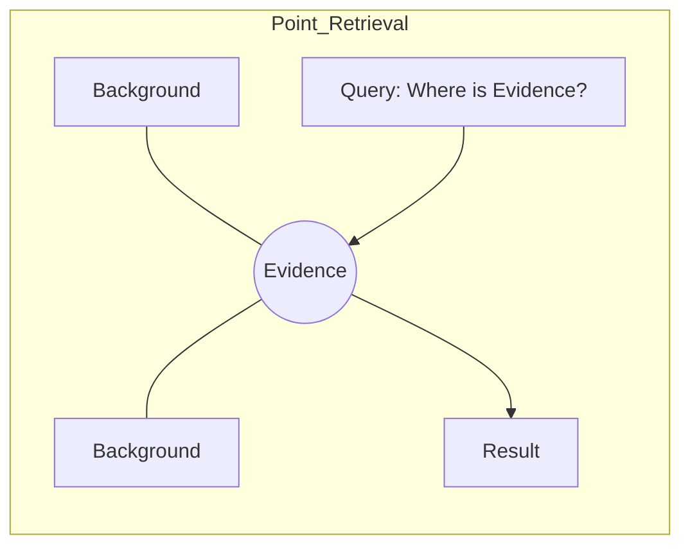
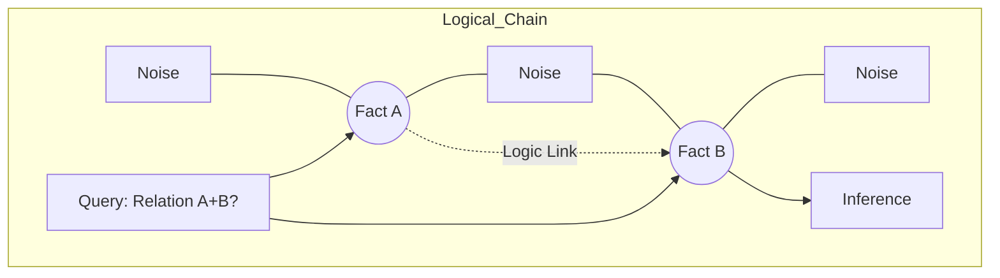
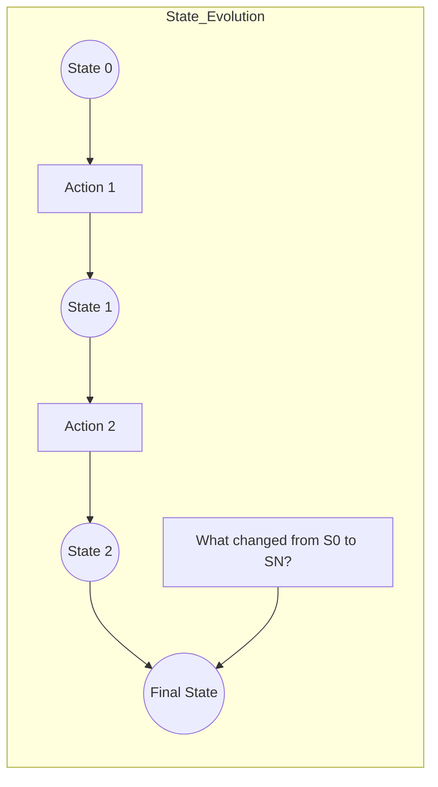
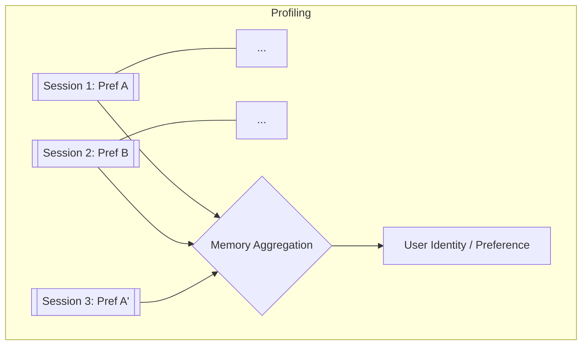
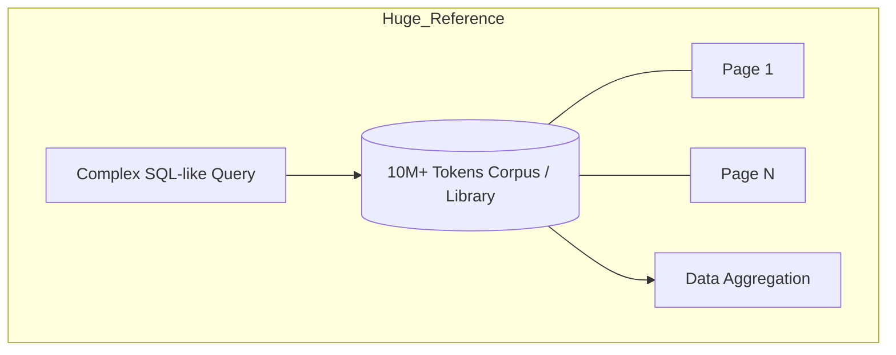

# LLM 长期记忆评测：统一映射架构指南 (2026版)

## 0. 抽象定义
在 Benchmark 接入层，我们将所有的长文本/记忆任务抽象为：
> **Memory Function**: $f(Context_{Noise}, \{Evidence_{1...n}\}, Trigger) \rightarrow Prediction$
> 其中，记忆的“类型”取决于 $\{Evidence\}$ 之间的**拓扑关系**。

---

## 1. 点状检索型 (Point-wise Retrieval)
**抽象逻辑**：单一事实的“大海捞针”。验证模型在海量噪声中定位特定信息点的物理极限。

### 映射关系
* **数据结构**：$1 \text{ Key} \rightarrow 1 \text{ Value}$
* **注意力特征**：单点高亮，其余遮蔽。
* **匹配 Benchmarks**：
    - `Needle In A Haystack`
    - [`RULER`](https://github.com/NVIDIA/RULER)
    - [`VideoNIAH (V-Needle)`](https://videoniah.github.io/)
    - `NeedleBench`

### Mermaid 可视化

---

## 2. 逻辑关联型 (Logical Association)
**抽象逻辑**：多点事实的跨长程聚合。验证模型在超长上下文中维持逻辑链条、进行多跳推理的能力。

### 映射关系
* **数据结构**：$Evidence_A + Evidence_B + ... + Evidence_N \rightarrow Conclusion$
* **注意力特征**：跨越噪声的“跳跃式”关联。
* **匹配 Benchmarks**：
    - [`BABILong (QA1-QA20)`](https://github.com/booydar/babilong)
    - [`SciTrek (2025)`](https://openreview.net/forum?id=loipspAYLx)
    - [`LoongRL`](https://arxiv.org/abs/2510.19363)。

### Mermaid 可视化

---

## 3. 状态演进型 (State Evolution)
**抽象逻辑**：动态环境下的记忆管理。验证模型在交互轨迹中实时更新、改写和提取关键状态的能力。

### 映射关系
* **数据结构**：$State_t = f(State_{t-1}, Action_t, Observation_t)$
* **注意力特征**：线性流动的记忆，存在“遗忘”与“更新”机制。
* **匹配 Benchmarks**：
    - [`MemoryArena`](https://memoryarena.github.io/)
    - [`AMA-Bench`](https://arxiv.org/abs/2602.22769)
    - `LoCoMo`.

### Mermaid 可视化

---

## 4. 用户画像型 (User Profiling)
**抽象逻辑**：离散交互中的模式识别。验证模型从跨会话（Cross-session）的琐碎信息中提取核心特质的能力。

### 映射关系
* **数据结构**：$Context_{Session 1...N} \rightarrow User\_Profile$
* **注意力特征**：全局加权聚合，识别“统计学意义”上的偏好。
* **匹配 Benchmarks**：
    - [`MemoryCD`](https://openreview.net/forum?id=Lpq4aEqvmg)
    - [`MemoryBench`](https://github.com/LittleDinoC/MemoryBench)
    - `PersonaMem`.

### Mermaid 可视化

---

## 5. 大规模参考型 (Large-scale Reference)
**抽象逻辑**：库级语义检索（RAG-Alternative）。验证模型直接处理千万级语料库并替代传统数据库检索的性能。

### 映射关系
* **数据结构**：$10M \text{ Tokens Corpus} \leftrightarrow \text{Structured Query}$
* **注意力特征**：高并发的语义匹配，极高的信噪比挑战。
* **匹配 Benchmarks**：
    - [`EverMemBench / EverMemBench-S`](https://github.com/EverMind-AI/EverMemBench)
    - [`LOFT (Google)`](https://arxiv.org/abs/2406.13136)
    - [`BEAM`](https://arxiv.org/abs/2510.27246)，`InfiniteBench`.

### Mermaid 可视化

---

## 总结：Benchmark 接入映射表

| 映射类型       | 复杂度 | 核心 API 接入参数 | 推荐初试项目 |
| :------------ | :----- | :--------- | :--- |
| **点状检索**   | $O(1)$ | `needle_depth`, `context_length` | **RULER** |
| **逻辑关联**   | $O(N)$ | `hop_count`, `logic_dist` | **BABILong** |
| **状态演进**   | $O(T)$ | `step_count`, `env_feedback` | **MemoryArena** |
| **用户画像**   | $O(S)$ | `session_count`, `pref_drift` | **MemoryCD** |
| **大规模参考** | $O(\text{Data})$| `corpus_size`, `query_type` | **EverMemBench-S / BEAM** |