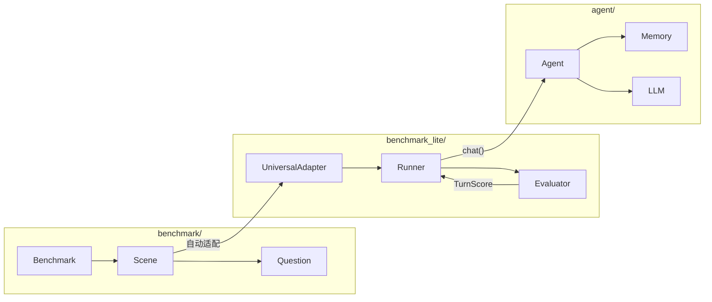

# UniversalBenchmark

一个将 **数据**、**执行逻辑**、**Agent（LLM + 记忆）** 三者解耦的通用记忆评测框架。

## 为什么这样设计

记忆评测的本质是：给定相同的信息输入和相同的问题，比较不同记忆系统的回答质量。

这要求三件事独立变化：

- **数据集**可以替换（今天跑 EverMemBench，明天跑你自己的数据集）
- **记忆后端**可以替换（BufferMemory、Memecho、你自己的实现）
- **评分逻辑**可以替换（关键词匹配、LLM 判分、自定义规则）

因此框架分为三层：

```
benchmark/          数据层 — 加载数据集，提供 Scene 和 Question
                         │
                         ▼
benchmark_lite/     逻辑层 — UniversalAdapter 转换 → Runner 执行 → Evaluator 评分
                         │
                         ▼
agent/              执行层 — Agent = LLM + Memory，接收消息、生成回复
```



## 你想做什么

| 目标 | 阅读 |
|------|------|
| 接入一个新的记忆系统（如你自己的向量数据库） | [guide-memory.md](guide-memory.md) |
| 把已有的数据集接入框架跑评测 | [guide-benchmark-data.md](guide-benchmark-data.md) |
| 需要自定义对话调度或评分逻辑 | [guide-benchmark-lite.md](guide-benchmark-lite.md) |
| 理解结果 JSON 的 Pydantic 模型 / 对接分析工具 | [guide-benchmark-lite.md > 结果 Pydantic 模型](guide-benchmark-lite.md#结果-pydantic-模型) |
| 在 Memory 实现中提供真实 Message ID | [guide-memory.md > Message ID 追踪协议](guide-memory.md#message-id-追踪协议) |

## 终端进度条（Rich）

评测主入口 `run_benchmark_lite.py` 在 **stderr 为 TTY** 时会建立共享 Rich `Console`：**loguru 日志与多任务进度**走同一后端，避免 stdout 日志与 stderr Live 进度错行；描述列按终端宽度截断（省略号）。`--no-progress` 仅关闭 Live 进度条，仍用同一 Console 打日志。重定向或非 TTY 下回退为普通 stderr 日志。同类子任务可用 `task_key` 复用一行（如 UniversalAdapter 加载、Runner 预置历史、LLM 单次调用等），减少重复刷屏。

编程方式自行跑 `Runner` 时，若需要相同效果，请在最外层使用：

```python
from agent.progress import progress_context

with progress_context():
    Runner().run(agent, benchmark)
```

在 `agent`、`memory`、`llm` 或自定义 Benchmark 内部通过 `get_progress()` 获取当前管理器；无上下文时为 **no-op**，不会报错。详见 [guide-benchmark-lite.md](guide-benchmark-lite.md#全局-rich-进度条) 与 [guide-memory.md](guide-memory.md#批量导入与进度)。

在**真实终端**里肉眼验证进度条，可运行 `python scripts/progress_smoke.py`（比在 pytest 捕获输出下更可靠）。

## 快速开始

```bash
cd UniversalBenchmark
pip install -r requirements.txt

# 用 BufferMemory 跑 EverMemBench 的第一个场景，取 5 个问题
python run_benchmark_lite.py \
    --benchmark benchmark.data.providers.evermind_ai.evermembench_static.EverMemBenchStaticBenchmark \
    --memory buffer \
    --model openrouter/google/gemini-2.5-flash-lite \
    --eval-model openrouter/google/gemini-2.5-flash \
    --scene-ids 0 \
    --max-questions 5 \
    -v
```

### CLI 参数速查

| 参数 | 作用 | 默认值 |
|------|------|--------|
| `--benchmark` | Benchmark 类的 Python import 路径 | 必填 |
| `--memory` | 记忆后端：`buffer` / `memecho` / `mem0` | `buffer` |
| `--model` | Agent 使用的 LLM | `openrouter/google/gemini-2.5-flash-lite` |
| `--eval-model` | 评分用的 LLM（数据层 Benchmark 时生效） | `openrouter/google/gemini-2.5-flash` |
| `--scene-ids` | 只跑指定 Scene | 全部 |
| `--max-questions` | 每个 Scene 最多取几个问题 | 全部 |
| `--max-turns` | BufferMemory 滑动窗口大小 | 不限 |
| `-v` | 显示每轮详情 | 关 |
| `-o FILE` | 结果写入 JSON 文件 | 不保存 |
| `--no-progress` | 关闭 Rich 进度条 | 关（TTY 下启用） |
