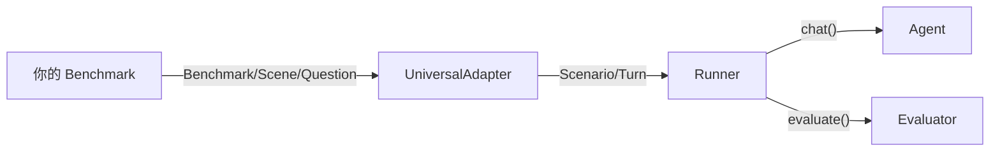

# 数据提供者实现指南

## 核心思想

你只负责提供数据——场景、问题、标准答案。框架负责把数据喂给 Agent、收集回答、评分、生成报告。

这通过 `UniversalAdapter` 实现：它读取你的数据接口，自动转换为框架可执行的格式。



## 你需要实现的接口

三个类，全部从 `benchmark.interfaces` 导入。

### 1. Question — 一个评估问题

```python
from benchmark.interfaces import Question, EvidenceBundle, ScoringConfig

question = Question(
    question_id="q001",
    question_text="主角的名字是什么？",
    ground_truth="张三",
    evidence=EvidenceBundle(evidence_type="none", payload={}),
    scoring=ScoringConfig(eval_mode="keyword", eval_prompt_key="default"),
)
```

`Question` 是 frozen dataclass，直接构造即可。关键字段：

| 字段 | 类型 | 作用 |
|------|------|------|
| `question_text` | `str` | 发送给 Agent 的问题 |
| `ground_truth` | `Any` | 标准答案，传给评分器 |
| `scoring.eval_mode` | `str` | 选择哪个评分器（见下文） |
| `scoring.max_score` | `float` | 该题满分，默认 `1.0` |

### 2. Scene — 一组问题 + 它们共享的上下文

```python
from benchmark.interfaces import Scene, Question

class MyScene(Scene):
    @property
    def scene_id(self) -> str:
        return "scene_0"

    def questions(self):
        yield Question(...)
        yield Question(...)
```

Scene 需要提供上下文——Agent 回答问题的信息来源。两种方式：

**方式 A：对话历史**（记忆测试：先聊天，再提问）

```python
from benchmark.interfaces import ConversationTurn

class MyScene(Scene):
    def conversation_history(self) -> list[ConversationTurn]:
        return [
            ConversationTurn("我叫小明，今年25岁", "你好小明！"),
            ConversationTurn("我住在北京", "好的，记住了。"),
        ]
    # ...
```

适配器将每轮对话注入 Agent 记忆，然后再逐个问问题。

**方式 B：背景语料**（检索测试：给文档，再提问）

```python
class MyScene(Scene):
    def background_text(self, *, max_chars=None, **kw) -> str:
        text = load_my_corpus()
        if max_chars:
            text = text[:max_chars]
        return text
    # ...
```

适配器将语料作为一整段文本注入 Agent 记忆。

两种方式可以共存。优先级：有 `conversation_history` 时用对话历史，否则用 `background_text`。

**可选属性：**

| 属性/方法 | 默认值 | 作用 |
|-----------|--------|------|
| `scene_name` | `None` | 可读名称，用于日志 |
| `task_type` | `None` | 任务类型标记 |

### 3. Benchmark — 枚举所有 Scene

```python
from benchmark.interfaces import Benchmark, Scene

class MyBenchmark(Benchmark):
    @property
    def benchmark_name(self) -> str:
        return "MyDataset"

    def list_scenes(self):
        return ["scene_0", "scene_1"]

    def get_scene(self, scene_id: str) -> Scene:
        return MyScene(scene_id)
```

**可选属性：**

| 属性 | 默认值 | 作用 |
|------|--------|------|
| `eval_prompt` | `""` | 自定义 LLM 评分 prompt，传给所有评分器 |

## 完整最小示例

```python
# benchmark/data/providers/my_dataset/my_benchmark.py

from benchmark.interfaces import (
    Benchmark, Scene, Question,
    ConversationTurn, EvidenceBundle, ScoringConfig,
)

class MemoryTestScene(Scene):
    @property
    def scene_id(self) -> str:
        return "basic"

    @property
    def scene_name(self) -> str:
        return "基础记忆测试"

    def conversation_history(self) -> list[ConversationTurn]:
        return [
            ConversationTurn("我叫小明，今年25岁，住在北京", "你好小明！"),
            ConversationTurn("我喜欢打篮球和弹吉他", "很棒的爱好！"),
        ]

    def questions(self):
        yield Question(
            question_id="name",
            question_text="我叫什么名字？",
            ground_truth="小明",
            evidence=EvidenceBundle(evidence_type="none", payload={}),
            scoring=ScoringConfig(eval_mode="keyword", eval_prompt_key="default"),
        )
        yield Question(
            question_id="hobby",
            question_text="我有哪些爱好？",
            ground_truth="篮球和吉他",
            evidence=EvidenceBundle(evidence_type="none", payload={}),
            scoring=ScoringConfig(eval_mode="binary", eval_prompt_key="default"),
        )

class MyBenchmark(Benchmark):
    @property
    def benchmark_name(self) -> str:
        return "MyMemoryTest"

    def list_scenes(self):
        return ["basic"]

    def get_scene(self, scene_id: str) -> Scene:
        return MemoryTestScene()
```

运行：

```bash
python run_benchmark_lite.py \
    --benchmark benchmark.data.providers.my_dataset.my_benchmark.MyBenchmark \
    --memory buffer \
    --model openrouter/google/gemini-2.5-flash-lite \
    -v
```

## 评分配置

### 内置评分器

在 `ScoringConfig(eval_mode=...)` 中指定：

| eval_mode | 工作方式 | 需要 LLM | 适用场景 |
|-----------|---------|----------|---------|
| `keyword` | `ground_truth` 中的关键词是否出现在回复中 | 否 | 答案是明确的单词/短语 |
| `binary` | LLM 判断回复是否正确（是/否） | 是 | 通用 |
| `score` | LLM 给出 0~1 连续分数 | 是 | 需要部分得分 |
| `weighted_binary` | 多项加权二元评判 | 是 | 多要点验证 |
| `benchmark_prompt` | 使用 `Benchmark.eval_prompt` 自定义 prompt | 是 | 数据集自带评分标准 |

LLM 评分使用 `--eval-model` 参数指定的模型。

### 自定义 eval_prompt

如果你的数据集有特殊的评分标准，在 Benchmark 类上定义：

```python
class MyBenchmark(Benchmark):
    @property
    def eval_prompt(self) -> str:
        return """判断回复是否正确。
回复：{response}
标准答案：{ground_truth}
只回答 PASS 或 FAIL。"""
```

然后在 Question 中使用 `eval_mode="benchmark_prompt"`。

## 文件组织

```
benchmark/
  data/
    providers/
      my_dataset/
        __init__.py          # 导出 MyBenchmark
        my_benchmark.py      # Benchmark / Scene / Question 实现
        data/                # 原始数据文件（可选）
```

## 现有实现参考

`benchmark/data/providers/evermind_ai/evermembench_static.py` — EverMemBench 的完整实现，展示了大规模语料加载、多 Scene 管理、自定义 eval_prompt 等实践。
