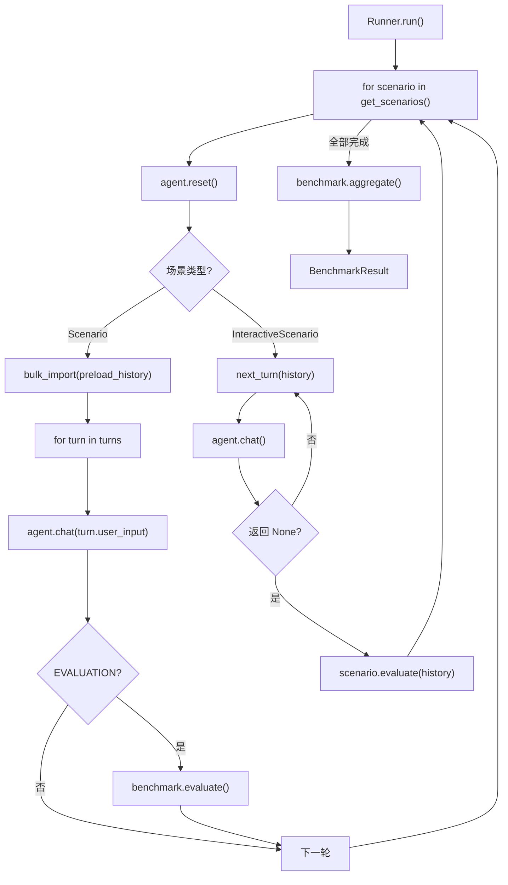

# 自定义 Benchmark 实现指南

## 何时使用

大多数情况下，你只需要实现数据接口（见 [guide-benchmark-data.md](guide-benchmark-data.md)），框架通过 `UniversalAdapter` 自动处理执行和评分。

直接实现 `BenchmarkLite` 仅在以下情况必要：

- 对话流程是**动态的**——下一轮问什么取决于上一轮的回答
- 评分逻辑**无法用标准评分器表达**——需要对整个对话历史进行整体评估
- 需要在对话过程中**注入干扰/修正**等特殊交互

## 接口定义

`BenchmarkLite`（`benchmark_lite/base.py`）有 4 个需要关注的方法：

```python
from benchmark_lite import BenchmarkLite

class MyBenchmark(BenchmarkLite):

    @property
    def name(self) -> str:
        """Benchmark 名称。"""

    def get_scenarios(self):
        """返回所有场景。每个场景独立运行，Agent 记忆在场景间重置。"""

    def evaluate(self, turn, response, history) -> TurnScore:
        """对单个 EVALUATION 回合评分。仅脚本化场景需要。"""

    def aggregate(self, scenario_results) -> AggregateResult:
        """汇总所有场景的评分为最终结果。"""
```

## 三种场景模式

### 模式 A：脚本化场景

预定义回合列表。`CONVERSATION` 回合只聊天不评分，`EVALUATION` 回合触发 `evaluate()`。

```python
from benchmark_lite import Scenario, Turn, TurnType

Scenario(
    id="recall_name",
    turns=[
        Turn("我叫小明，今年25岁"),                                    # CONVERSATION（默认）
        Turn("今天天气真好"),                                           # CONVERSATION
        Turn("我叫什么？", TurnType.EVALUATION, reference="小明"),      # EVALUATION
    ],
)
```

### 模式 B：预置历史

对话历史已给定，Agent 跳过聊天直接回答问题。适用于记忆的"回忆"能力测试。

```python
from benchmark_lite import Scenario, Turn, TurnType, HistoryTurn

Scenario(
    id="history_qa",
    preload_history=[
        HistoryTurn("我叫张三", "你好张三！"),
        HistoryTurn("我住在北京", "好的。"),
    ],
    turns=[
        Turn("我叫什么？住在哪？", TurnType.EVALUATION, reference=["张三", "北京"]),
    ],
)
```

`preload_history` 在场景开始时通过 `agent.bulk_import()` 一次性注入记忆。

### 模式 C：交互式场景

动态生成回合，场景结束后整体评估。

```python
from benchmark_lite import InteractiveScenario, Turn, ScenarioScore

class AdaptiveTest(InteractiveScenario):
    @property
    def id(self) -> str:
        return "adaptive"

    def next_turn(self, history):
        """返回下一轮 Turn，返回 None 结束对话。"""
        if len(history) >= 5:
            return None
        return Turn(f"第 {len(history) + 1} 个问题...")

    def evaluate(self, history) -> ScenarioScore:
        """对话结束后，根据全部历史评分。"""
        correct = sum(1 for r in history if "正确" in r.response)
        return ScenarioScore(
            score=correct / len(history),
            passed=correct > len(history) * 0.6,
        )
```

## 完整最小示例

```python
from benchmark_lite import (
    AggregateResult, BenchmarkLite, Scenario, ScenarioResult,
    Turn, TurnResult, TurnScore, TurnType,
)

class SimpleRecallBenchmark(BenchmarkLite):

    @property
    def name(self) -> str:
        return "SimpleRecall"

    def get_scenarios(self):
        return [
            Scenario(id="test_1", turns=[
                Turn("我的密码是 42"),
                Turn("我的密码是多少？", TurnType.EVALUATION, reference="42"),
            ]),
        ]

    def evaluate(self, turn, response, history) -> TurnScore:
        found = str(turn.reference) in response
        return TurnScore(score=1.0 if found else 0.0, passed=found)

    def aggregate(self, scenario_results) -> AggregateResult:
        scores = [s for sr in scenario_results for s in sr.eval_scores]
        total = len(scores)
        passed = sum(1 for s in scores if s.passed)
        return AggregateResult(
            score=passed / total if total else 0.0,
            total_score=sum(s.score for s in scores),
            total_max_score=float(total),
            total=total,
            passed=passed,
        )
```

运行：

```bash
python run_benchmark_lite.py \
    --benchmark path.to.SimpleRecallBenchmark \
    --memory buffer \
    --model openrouter/google/gemini-2.5-flash-lite \
    -v
```

## 自定义评分器

如果内置评分器不满足需求，用 `@register_evaluator` 注册自定义评分器：

```python
from benchmark_lite.evaluators import BaseEvaluator, register_evaluator
from benchmark_lite.types import TurnScore

@register_evaluator("my_eval")
class MyEvaluator(BaseEvaluator):
    def __init__(self, model: str = "", **kwargs):
        super().__init__(**kwargs)

    def evaluate(self, question_text, ground_truth, response,
                 max_score=1.0, evidence=None) -> TurnScore:
        passed = your_custom_logic(response, ground_truth)
        return TurnScore(
            score=max_score if passed else 0.0,
            passed=passed,
        )
```

注册后可在数据层 Benchmark 的 `ScoringConfig(eval_mode="my_eval")` 中使用。确保模块在运行前被 import（放在 `benchmark_lite/evaluators/` 下会自动加载）。

## 数据结构速查

### 输入

| 结构 | 字段 | 用途 |
|------|------|------|
| `Turn` | `user_input`, `turn_type`, `reference`, `metadata` | 一轮对话 |
| `HistoryTurn` | `user_message`, `assistant_response` | 预置历史 |
| `Scenario` | `id`, `turns`, `preload_history`, `metadata` | 脚本化场景 |

### 输出

| 结构 | 字段 | 用途 |
|------|------|------|
| `TurnScore` | `score`, `passed`, `detail` | 单轮评分 |
| `TurnResult` | `turn_index`, `user_input`, `response`, `score` | 单轮运行记录 |
| `ScenarioResult` | `scenario_id`, `turn_results`, `scenario_score` | 场景运行记录 |
| `AggregateResult` | `score`, `total`, `passed`, `total_score`, `total_max_score` | 最终汇总 |

### Runner 执行流程



## 文件组织

```
benchmark_lite/
  benchmarks/
    my_bench/
      __init__.py
      benchmark.py      # BenchmarkLite 子类
```
