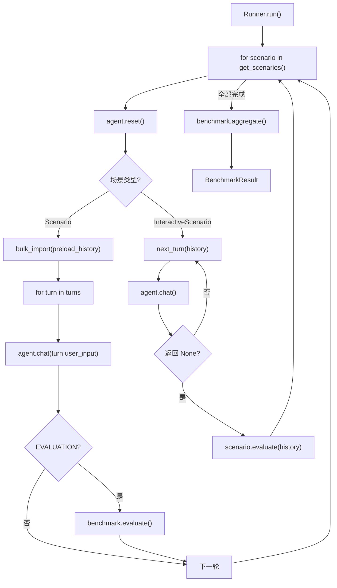

# 自定义 Benchmark 实现指南

## 何时使用

大多数情况下，你只需要实现数据接口（见 [guide-benchmark-data.md](guide-benchmark-data.md)），框架通过 `UniversalAdapter` 自动处理执行和评分。

直接实现 `BenchmarkLite` 仅在以下情况必要：

- 对话流程是**动态的**——下一轮问什么取决于上一轮的回答
- 评分逻辑**无法用标准评分器表达**——需要对整个对话历史进行整体评估
- 需要在对话过程中**注入干扰/修正**等特殊交互

## 接口定义

`BenchmarkLite`（`benchmark_lite/base.py`）有 4 个需要关注的方法：

```python
from benchmark_lite import BenchmarkLite

class MyBenchmark(BenchmarkLite):

    @property
    def name(self) -> str:
        """Benchmark 名称。"""

    def get_scenarios(self):
        """返回所有场景。每个场景独立运行，Agent 记忆在场景间重置。"""

    def evaluate(self, turn, response, history) -> TurnScore:
        """对单个 EVALUATION 回合评分。仅脚本化场景需要。"""

    def aggregate(self, scenario_results) -> AggregateResult:
        """汇总所有场景的评分为最终结果。"""
```

## 三种场景模式

### 模式 A：脚本化场景

预定义回合列表。`CONVERSATION` 回合只聊天不评分，`EVALUATION` 回合触发 `evaluate()`。

```python
from benchmark_lite import Scenario, Turn, TurnType

Scenario(
    id="recall_name",
    turns=[
        Turn("我叫小明，今年25岁"),                                    # CONVERSATION（默认）
        Turn("今天天气真好"),                                           # CONVERSATION
        Turn("我叫什么？", TurnType.EVALUATION, reference="小明"),      # EVALUATION
    ],
)
```

### 模式 B：预置历史

对话历史已给定，Agent 跳过聊天直接回答问题。适用于记忆的"回忆"能力测试。

```python
from benchmark_lite import Scenario, Turn, TurnType, HistoryTurn

Scenario(
    id="history_qa",
    preload_history=[
        HistoryTurn("我叫张三", "你好张三！"),
        HistoryTurn("我住在北京", "好的。"),
    ],
    turns=[
        Turn("我叫什么？住在哪？", TurnType.EVALUATION, reference=["张三", "北京"]),
    ],
)
```

`preload_history` 在场景开始时通过 `agent.bulk_import()` 一次性注入记忆。

### 模式 C：交互式场景

动态生成回合，场景结束后整体评估。

```python
from benchmark_lite import InteractiveScenario, Turn, ScenarioScore

class AdaptiveTest(InteractiveScenario):
    @property
    def id(self) -> str:
        return "adaptive"

    def next_turn(self, history):
        """返回下一轮 Turn，返回 None 结束对话。"""
        if len(history) >= 5:
            return None
        return Turn(f"第 {len(history) + 1} 个问题...")

    def evaluate(self, history) -> ScenarioScore:
        """对话结束后，根据全部历史评分。"""
        correct = sum(1 for r in history if "正确" in r.response)
        return ScenarioScore(
            score=correct / len(history),
            passed=correct > len(history) * 0.6,
        )
```

## 完整最小示例

```python
from benchmark_lite import (
    AggregateResult, BenchmarkLite, Scenario, ScenarioResult,
    Turn, TurnResult, TurnScore, TurnType,
)

class SimpleRecallBenchmark(BenchmarkLite):

    @property
    def name(self) -> str:
        return "SimpleRecall"

    def get_scenarios(self):
        return [
            Scenario(id="test_1", turns=[
                Turn("我的密码是 42"),
                Turn("我的密码是多少？", TurnType.EVALUATION, reference="42"),
            ]),
        ]

    def evaluate(self, turn, response, history) -> TurnScore:
        found = str(turn.reference) in response
        return TurnScore(score=1.0 if found else 0.0, passed=found)

    def aggregate(self, scenario_results) -> AggregateResult:
        scores = [s for sr in scenario_results for s in sr.eval_scores]
        total = len(scores)
        passed = sum(1 for s in scores if s.passed)
        return AggregateResult(
            score=passed / total if total else 0.0,
            total_score=sum(s.score for s in scores),
            total_max_score=float(total),
            total=total,
            passed=passed,
        )
```

运行：

```bash
python run_benchmark_lite.py \
    --benchmark path.to.SimpleRecallBenchmark \
    --memory buffer \
    --model openrouter/google/gemini-2.5-flash-lite \
    -v
```

## 自定义评分器

如果内置评分器不满足需求，用 `@register_evaluator` 注册自定义评分器：

```python
from benchmark_lite.evaluators import BaseEvaluator, register_evaluator
from benchmark_lite.types import TurnScore

@register_evaluator("my_eval")
class MyEvaluator(BaseEvaluator):
    def __init__(self, model: str = "", **kwargs):
        super().__init__(**kwargs)

    def evaluate(self, question_text, ground_truth, response,
                 max_score=1.0, evidence=None) -> TurnScore:
        passed = your_custom_logic(response, ground_truth)
        return TurnScore(
            score=max_score if passed else 0.0,
            passed=passed,
        )
```

注册后可在数据层 Benchmark 的 `ScoringConfig(eval_mode="my_eval")` 中使用。确保模块在运行前被 import（放在 `benchmark_lite/evaluators/` 下会自动加载）。

## 数据结构速查

### 输入

| 结构 | 字段 | 用途 |
|------|------|------|
| `Turn` | `user_input`, `turn_type`, `reference`, `metadata` | 一轮对话 |
| `HistoryTurn` | `user_message`, `assistant_response` | 预置历史 |
| `Scenario` | `id`, `turns`, `preload_history`, `metadata` | 脚本化场景 |

### 输出

| 结构 | 字段 | 用途 |
|------|------|------|
| `TurnScore` | `score`, `passed`, `detail`, `metadata` | 单轮评分 |
| `TurnResult` | `turn_index`, `user_input`, `response`, `score`, `metadata`, `message_trace`, `depends_on_turn_indices`, `dependency_policy` | 单轮运行记录 |
| `ScenarioResult` | `scenario_id`, `turn_results`, `scenario_score`, `metadata`, `preload_history`, `memory_library_id` | 场景运行记录 |
| `AggregateResult` | `score`, `total`, `passed`, `total_score`, `total_max_score`, `extra` | 最终汇总 |
| `MessageTrace` | `user_message_id`, `assistant_message_id`, `id_source`, `query_request_id`, `append_request_id` | 消息追踪 |
| `RunConfig` | `memory_type`, `model`, `eval_model`, `system_prompt`, `extra` | 运行配置快照 |
| `BenchmarkResult` | `benchmark_name`, `agent_identifier`, `scenario_results`, `aggregate`, `timestamp`, `run_config` | 完整结果 |

### 全局 Rich 进度条

框架在 **单一进程内** 只维护一个 Rich `Progress`（及关联 `Console`），避免多处各自 `Progress()` 导致渲染冲突。

- **CLI**：`run_benchmark_lite.py` 在 stderr 为 TTY 且未传 `--no-progress` 时，自动 `with progress_context(): runner.run(...)`。`Runner` 会更新「场景总进度」「每场景回合」「语料/预置历史导入」等子任务；`Agent` 侧 LLM 与 Memory（含 Memecho 导入/SSE）也会向同一管理器追加任务。
- **编程调用**：若你直接 `Runner().run(...)`，需要同样效果时请自行包裹：

```python
from agent.progress import progress_context
from benchmark_lite import Runner

with progress_context():
    Runner().run(agent, benchmark)
```

- **Benchmark 开发者**：在 `get_scenarios`、`InteractiveScenario.next_turn` 或自定义预处理循环中，使用 `benchmark_lite` 或 `agent` 导出的 API：

```python
from benchmark_lite import get_progress

pg = get_progress()
h = pg.add_task("自定义阶段", total=None)
try:
    pg.update(h, description="处理中…")
    ...
finally:
    pg.remove_task(h)
```

未开启 `progress_context` 时，`get_progress()` 返回 **no-op** 管理器，调用 `add_task` / `advance` 等无副作用。更多示例见 `benchmark_lite/examples/progress_demo.py`。

### Runner 执行流程



## 结果 Pydantic 模型

所有输出侧数据结构定义在 `benchmark_lite/types.py` 中，均为 Pydantic `BaseModel`。你可以直接导入这些类型来解析 benchmark 输出的 JSON 文件，或者在自己的分析工具中使用它们做类型校验。

```python
from benchmark_lite.types import BenchmarkResult

# 从 JSON 文件加载结果
import json
with open("results.json") as f:
    data = json.load(f)
result = BenchmarkResult.model_validate(data)

# 遍历每个场景的每个回合
for sr in result.scenario_results:
    for tr in sr.turn_results:
        print(f"Turn {tr.turn_index}: {tr.user_input[:50]}...")
        if tr.message_trace:
            print(f"  user_msg_id: {tr.message_trace.user_message_id}")
            print(f"  id_source:   {tr.message_trace.id_source}")
        if tr.score:
            print(f"  score: {tr.score.score}, passed: {tr.score.passed}")
```

### 完整模型结构

```
BenchmarkResult
├── benchmark_name: str
├── agent_identifier: str
├── timestamp: str
├── metadata: dict
│   └── scenario_memory_library_ids?: dict[scenario_id, memory_library_id]
├── run_config: RunConfig?
│   ├── memory_type: str
│   ├── model: str
│   ├── eval_model: str
│   ├── system_prompt: str
│   └── extra: dict
├── aggregate: AggregateResult
│   ├── score: float
│   ├── total_score: float
│   ├── total_max_score: float
│   ├── total: int
│   ├── passed: int
│   ├── detail: str
│   └── extra: dict
└── scenario_results: list[ScenarioResult]
    ├── scenario_id: str
    ├── scenario_description: str
    ├── metadata: dict
    ├── preload_history: list[PreloadHistoryEntry]
    ├── memory_library_id: str
    │   ├── user_message: str
    │   └── assistant_response: str
    ├── scenario_score: ScenarioScore?
    │   ├── score: float
    │   ├── passed: bool
    │   ├── detail: str
    │   ├── metadata: dict
    │   └── turn_annotations: list[TurnAnnotation]
    │       ├── turn_index: int
    │       ├── label: str
    │       └── score: TurnScore?
    └── turn_results: list[TurnResult]
        ├── turn_index: int
        ├── user_input: str
        ├── response: str
        ├── turn_type: "conversation" | "evaluation"
        ├── metadata: dict    ← 包含 question_id, ground_truth, evidence 等
        ├── depends_on_turn_indices: list[int]
        ├── dependency_policy: str
        ├── score: TurnScore?
        │   ├── score: float
        │   ├── passed: bool
        │   ├── detail: str
        │   └── metadata: dict
        └── message_trace: MessageTrace?
            ├── user_message_id: str
            ├── assistant_message_id: str
            ├── id_source: "provider" | "framework"
            ├── query_request_id: str
            ├── append_request_id: str
            └── extra: dict
```

### JSON 导出兼容性

通过 `-o results.json` 导出的 JSON 保持与旧版本的兼容——所有原有顶层键（`benchmark_name`、`agent_identifier`、`timestamp`、`aggregate`、`metadata`、`scenarios`）不变，新增的字段以追加方式出现：

| 新增字段 | 位置 | 说明 |
|----------|------|------|
| `run_config` | 顶层 | 运行配置快照 |
| `metadata.scenario_memory_library_ids` | 顶层 | 每个场景使用的记忆库 id 映射 |
| `metadata` | scenario 级 | 场景元数据（task_type、source_benchmark 等） |
| `preload_history` | scenario 级 | 预置历史条目 |
| `memory_library_id` | scenario 级 | 该场景运行时使用的记忆库 id |
| `metadata` | turn 级 | 来自 Turn.metadata 的原始元数据 |
| `message_trace` | turn 级 | 消息 id 追踪 |
| `depends_on_turn_indices` | turn 级 | 评估回合依赖的前序 turn 索引 |
| `dependency_policy` | turn 级 | 依赖生成策略（如 `ref` / `subtest_prefix_fallback`） |

### 在分析工具中使用

记忆提供者可以将结果 JSON 载入为 Pydantic 模型后，轻松构建自己的分析管线：

```python
from benchmark_lite.types import BenchmarkResult, TurnResult

result = BenchmarkResult.model_validate_json(open("results.json").read())

# 提取所有 provider message id（仅限实现了真实 id 的后端）
provider_ids = [
    (tr.message_trace.user_message_id, tr.message_trace.assistant_message_id)
    for sr in result.scenario_results
    for tr in sr.turn_results
    if tr.message_trace and tr.message_trace.id_source == "provider"
]

# 按场景统计通过率
for sr in result.scenario_results:
    total = sr.eval_count
    passed = sr.passed_count
    print(f"场景 {sr.scenario_id}: {passed}/{total} 通过")
```

## 文件组织

```
benchmark_lite/
  benchmarks/
    my_bench/
      __init__.py
      benchmark.py      # BenchmarkLite 子类
```
